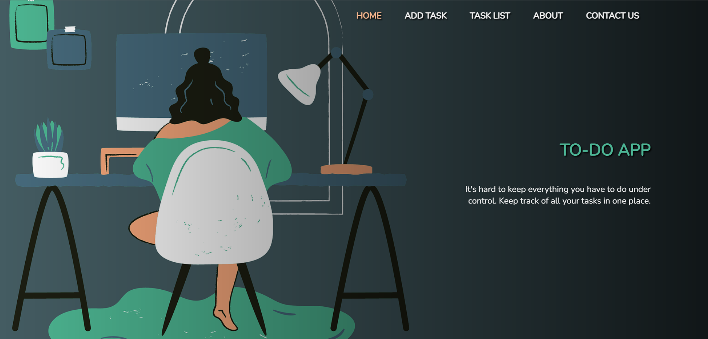
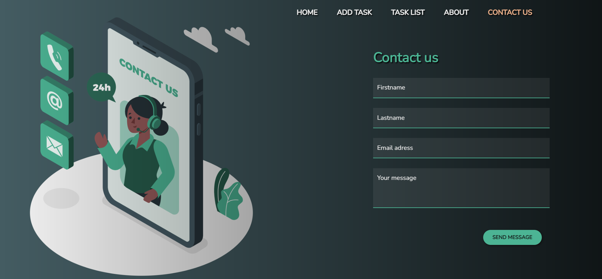

# To-do app (⚠️`In development!`⚠️)

To-do app is planned to be a simple app that will allow users to list all their scheduled tasks in one place. The app would also provide the possibility of editing the tasks, deleting them all or individually. 

<hr>

## Showcase


<!--  -->

<hr>

## Tech and tools used

<div>


</div>

<hr>

## Project setup
```
npm install
```

### Compiles and hot-reloads for development
```
npm run serve
```

### Compiles and minifies for production
```
npm run build
```

### Lints and fixes files
```
npm run lint
```
